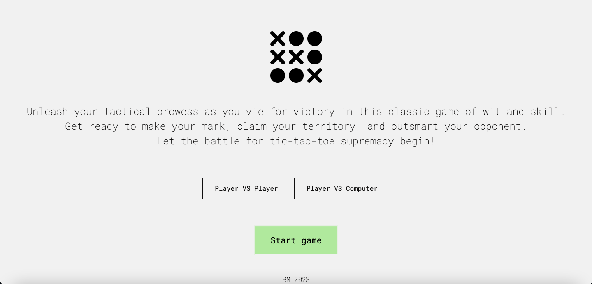

# X and O _game

Tic-Tac-Toe is a classic paper-and-pencil game played on a grid of 3x3 squares. This repository contains a web-based implementation of the Tic-Tac-Toe game using HTML, CSS, and JavaScript. Players take turns marking X or O in empty squares, and the objective is to have three of their marks in a horizontal, vertical, or diagonal row.

## [Demo](https://bbm2910.github.io/X_and_O-game/)

## Features
Two players can participate in the game.
The game board is displayed on a 3x3 grid.
Players take turns marking X or O in empty squares.
The game validates and prevents invalid moves, determines the winner or declares a draw and keeps track of each player's score.
Players can choose to play again or reset the game.

## Getting Started
To get started with the Tic-Tac-Toe game, follow these steps:
Clone or download the repository from https://github.com/bobby2910/Tic-Tac-Toe.
Navigate to the project directory.
Open the index.html file in a web browser.

## How to Play
Once the game is loaded in your web browser, it will display the game board.
Player 1 starts the game by clicking on an empty square on the board. The square will be marked with an X.
Player 2 takes their turn by clicking on another empty square. The square will be marked with an O.
Players continue taking turns until one player wins or the game ends in a draw.
The game automatically determines the winner and updates the scores accordingly.
Enjoy playing Tic-Tac-Toe!

